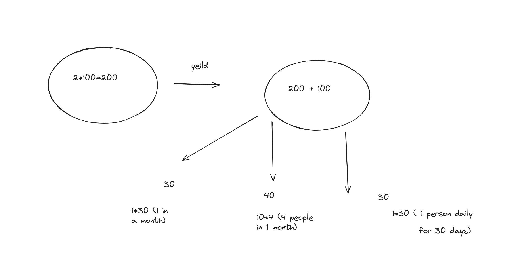

# WinWin-Lottery

## Overview

**WinWin-Lottery** is a no-loss lottery platform where users stake their tokens to earn yield over time. The yield generated from staked tokens is pooled and distributed as rewards without the risk of losing the initial deposit. Participants can win rewards in daily, weekly, and monthly lotteries, creating a sustainable and user-friendly way to earn while maintaining full control over their deposits.

## Key Features

- **Zero-Loss Participation**: Stake tokens, earn yield, and participate in the lottery with no risk of losing the initial deposit.
- **Rewards Distribution**: The yield generated from staking is pooled and distributed as lottery rewards (daily, weekly, and monthly).
- **Sustainable Model**: Users only win or withdraw their full deposit, while the generated yield is pooled for lottery rewards.
- **Multiple Reward Tiers**:
  - **Daily Rewards**: Small, frequent rewards to keep users engaged.
  - **Weekly Rewards**: Larger rewards for mid-term stakers.
  - **Monthly Rewards**: The largest rewards for long-term participants.
- **No-Loss Withdrawal**: Users can withdraw their initial deposit at any time, and their share of the yield contributes to the reward pools.
- **Yield Generation**: Assets are staked in secure DeFi platforms (e.g., Aave, Compound) for consistent yield generation.
- **Protocol Fees**: A small percentage of the yield is allocated to the protocol to ensure sustainability.
- **User-Friendly Interface**: Simplified DeFi interaction, making it easy for users to stake tokens and start earning rewards.
- **Scalability**: Supports multiple tokens and integrates with additional DeFi yield protocols over time.

## How It Works

1. **Staking**:  
   Users deposit ERC-20 tokens into the protocol, which are locked for a specific period (daily, weekly, or monthly), depending on the selected reward tier.

2. **Yield Generation**:  
   The protocol stakes the assets in yield-generating DeFi platforms like Aave or Compound, earning interest over time.

3. **Lottery Pools**:  
   The interest generated from staked assets is pooled into reward categories (daily, weekly, and monthly).

4. **No-Loss Withdrawal**:  
   Users can withdraw their initial deposit at any time. However, their share of the yield will contribute to the prize pools.

5. **Protocol Fees**:  
   A small portion of the yield is taken as a protocol fee to ensure operational sustainability.

## Economic Model

1. **Revenue Generation**:  
   - **Protocol Fee**: A small percentage of the generated yield is taken as a fee. This fee does not affect the user's initial deposit, only the yield.
   
2. **Staking Incentives**:  
   Protocol tokens may be introduced in the future to incentivize longer staking durations, encouraging users to stake for extended periods and earn additional rewards.

3. **Partnerships & Collaborations**:  
   Future partnerships with DeFi protocols and projects can enhance yield generation and reward distribution.

4. **Premium Memberships (Future Scope)**:  
   Offering premium features or memberships that allow users to access increased rewards, exclusive prize pools, and faster withdrawals.

## Benefits

- **No-Loss Mechanism**: Users can only win or withdraw their full deposit, ensuring no financial loss.
- **Multiple Reward Tiers**: Daily, weekly, and monthly rewards offer flexible participation options.
- **Yield Generation**: Consistent returns through secure DeFi protocols like Aave and Compound.
- **Simple Interface**: A user-friendly platform that does not require in-depth DeFi knowledge.
- **Sustainability**: Protocol fees and staking incentives ensure long-term sustainability.

### Example img 

## Getting Started

1. **Stake Tokens**:  
   Choose the amount and type of ERC-20 tokens to stake. Select a reward duration (daily, weekly, or monthly) based on your preferences.

2. **Earn Yield**:  
   Staked tokens are automatically deposited into yield-generating DeFi platforms like Aave or Compound, earning interest over time.

3. **Participate in Lottery**:  
   The interest generated from staked assets is pooled into prize categories (daily, weekly, and monthly). Users automatically participate by staking tokens.

4. **Withdraw at Any Time**:  
   Users can withdraw their initial deposit anytime, regardless of whether they won rewards.

## Requirements

- An ERC-20 compatible wallet
- Ethereum-based tokens (e.g., USDC, DAI) for staking
- Internet connection to access the platform

## License

This project is licensed under the MIT License. See the LICENSE file for more details.

---

Thank you for using **WinWin-Lottery**! Stake your tokens, earn rewards, and enjoy a no-loss lottery experience.
